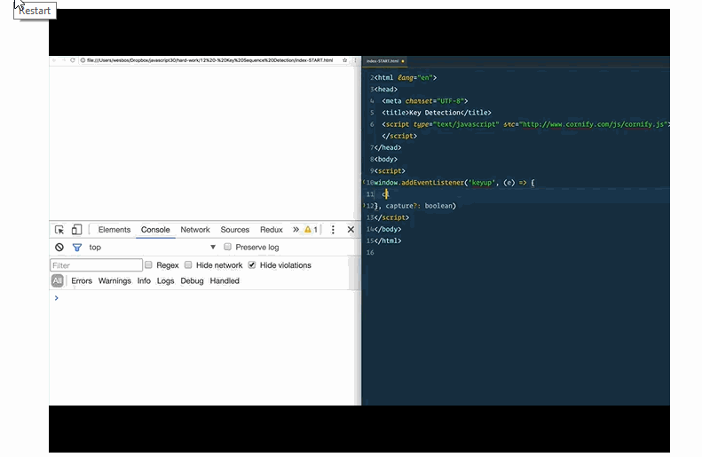

# _PLAYER.JS_ :boom:
Insert a custom HTML5 Video Player in your website.

## Description
This project provides custom Video Player for your website. The default browser video player is dull and creating a new one is a hectic task.
Through this project you can create highly customized video players in minutes.

## Languages used
It uses pure JAVASCRIPT for scripting and CSS3 for styling. There is **zero** dependency on JQUERY or anything else.

## Features

- Volume can be increased or decreased by using up :arrow_up: or down :arrow_down: arrow key respectively. Video must be focused first.
- Use space bar or click to Play/Pause the video. Focus the video first.
- Video Title is shown on hover.
- Go forwards or backwards by 10 seconds by using Right :arrow_forward: or Left :arrow_backward: arrow key respectively. Focus on video is necessary.
- Double click to toggle Full Screen Mode.
- Change backdrop color easily. Backdrop color is seen when the video aspect ratio is different from outer division's aspect ratio.
- Change Progress-bar's color.
- Autoplay video on load.

## Some GIFs



## Installation

**1.** Include this css file inside Head section.
```
<link rel='stylesheet' href='player.css'\>
```
**2.** Include fontawesome from cdn.
```
<link rel="stylesheet" href="https://use.fontawesome.com/releases/v5.0.13/css/all.css" integrity="sha384-DNOHZ68U8hZfKXOrtjWvjxusGo9WQnrNx2sqG0tfsghAvtVlRW3tvkXWZh58N9jp" crossorigin="anonymous"\>
```

**3.** Include this script at the end of body.
```
<script src="player.js"\></script\>
```

**4.** Customize the default behaviour using playerSettings( ) function, if necessary.  **Call this function below player.js**
```
    <script>
      playerSettings({
        progressBar: 'orange',
        backDrop: 'grey',
        autoplay: 'true'
      });
    </script>
```

## Default Values
| Property/Element | Default Value/color |
|----------|---------------|
| Progress bar | red |
| autoplay | false |
| Backdrop |  #000 (Black) |

> You can change these Default Values using playerSettings( ) function.

## Contribution
This project is in beginning stage and contains a few bugs.

It is not yet mobile friendly and many other features can be added too.

**_All the Contributions are appreciated._**

### **_Built with :heart: by DHARMIK JOSHI_**
